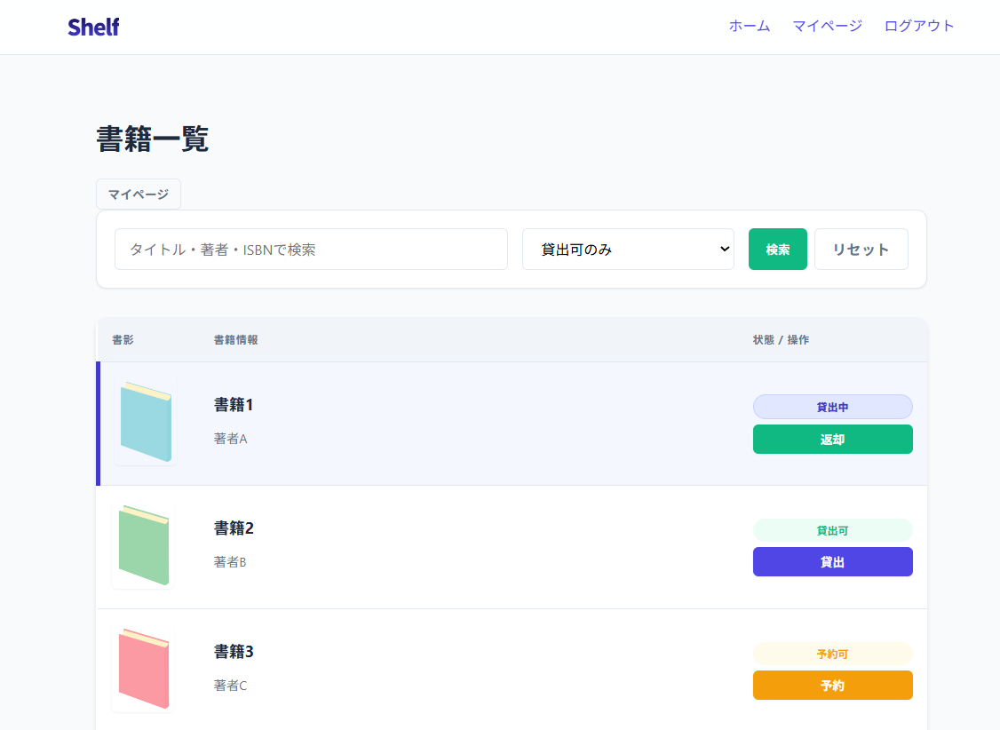
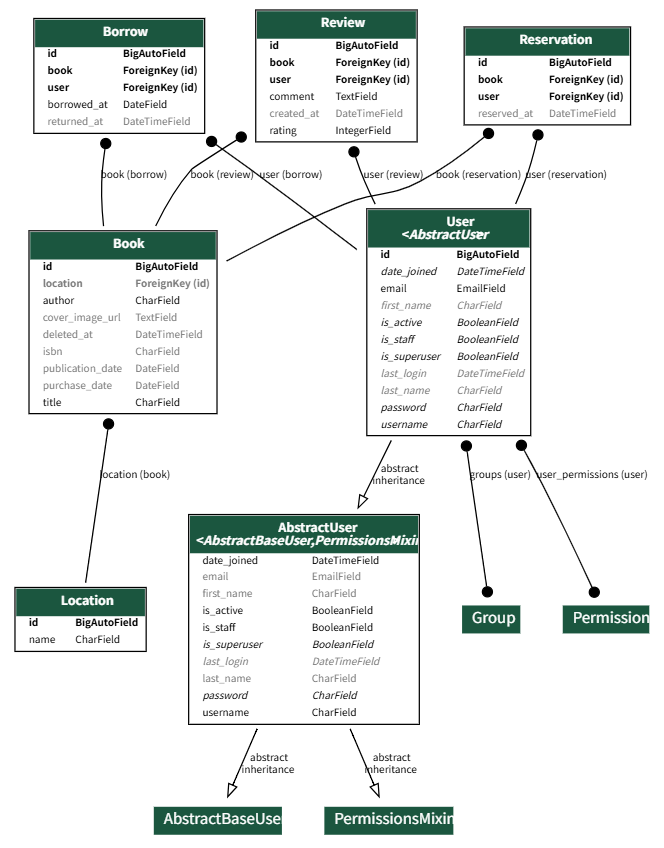
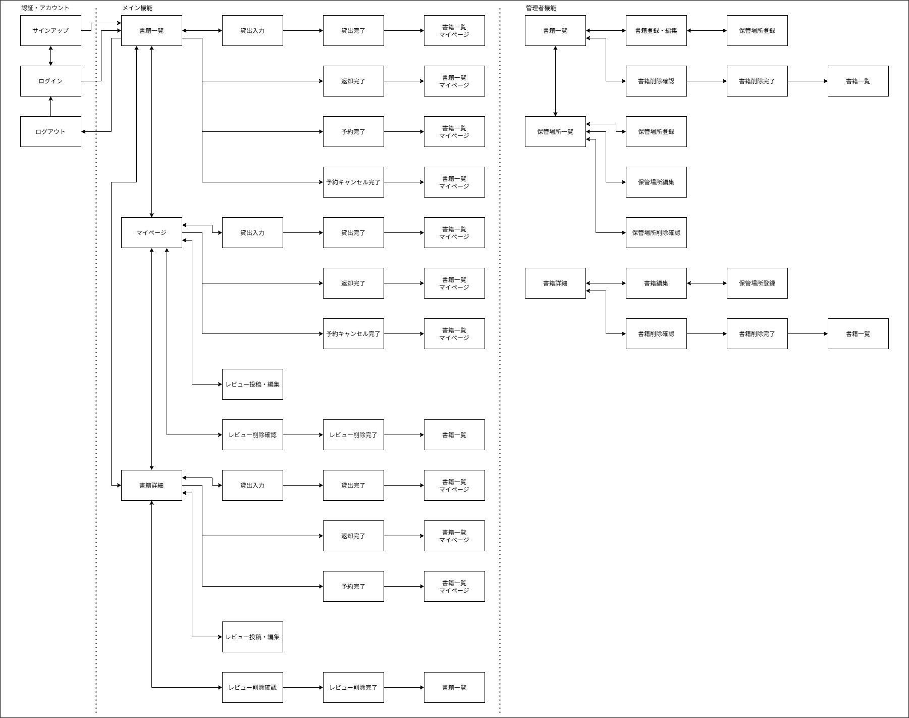

# 分散型図書管理システム Shelf

オフィスビルの各フロアや複数の本棚に分散して保管されている書籍を、ひとつの**仮想本棚**として統合管理できる社内向け図書管理システムです。
貸出・予約・返却を一元管理し、「どこに・誰が・どの本を持っているか」を可視化します。

<p align="center">
  
</p>

---

## 開発背景

### 【課題】
社内の書籍が複数のフロアや本棚に分散して保管されており、以下のような問題が発生していました。
* どの本がどこにあるのかわからない
* 誰が借りているのかを把握できない
* 社内資産として十分に活用できない

### 【解決策】
* 貸出・予約・返却フローのシステム化
* 保管場所（Location）単位での検索・管理
* ISBNによる書籍情報の自動取得

---

## 主な機能

### 1. 書籍ステータス管理
* 貸出状況（`Borrow`）と予約状況（`Reservation`）から、書籍状態を動的に判定
* 「貸出可」「予約可」「貸出中」「予約者待ち」の4状態を管理
* フロントエンドのバッジ表示と連携

### 2. 管理者向け機能
* 書籍情報・保管場所（Location）のCRUD
* ISBNによる書籍情報の自動取得
* openBDやGoogle Books APIとの連携

### 3. ユーザー認証
* `AbstractUser` を拡張したカスタムユーザーモデルを採用
* 将来的なユーザー属性の追加に対応できる構成
* ログアウト処理はPOST限定とし、CSRFリスクを軽減
* `next` パラメータを利用したログイン後リダイレクトに対応

### 4. UXと権限制御
* 貸出・予約制限ロジック
* レビュー・評価機能
* 「過去に借りたことのあるユーザーのみレビュー可能」という認可制御を実装

---

## 技術スタック & 開発環境

本プロジェクトで使用している技術、外部API、および開発環境の一覧です。

### 1. 技術スタック

| レイヤー | サービス | 補足 |
| :--- | :--- | :--- |
| **バックエンド** | Python 3.14 | |
| | Django 6.0 | |
| **フロントエンド** | HTML / CSS / JavaScript | レスポンシブ対応 |
| **データベース** | SQLite 3 | 開発環境 |
| **外部API** | openBD | 書籍情報取得 |
| | Google Books API | カバー画像フォールバック |

### 2. 開発環境

* **OS**: Windows 11
* **Editor**: Visual Studio Code
* **開発期間**: 約2ヶ月

---

## アーキテクチャ（3層構造 + 認可の分離）

ViewやModelの肥大化を防ぎ、保守性を向上させるため、責務分離を意識した設計にしました。

```text
[HTTP Request]
      │
      ▼
  Views.py
      │
      ├───────────────────────┐
      ▼                       ▼
  Services層              Selectors層
 (副作用の管理)          (読み取り専用処理)
      │                       │
      └───────────┬───────────┘
                  ▼
              Domain層
        (純粋なビジネスルール)
                  ▲
                  │
           Permissions層
           (認可ロジック)
```

### 各レイヤーの責務
1. **Domain層** (`domain/`)
   * 貸出・予約の上限判定などのビジネスルールを集約
   * DBやHTTPリクエストへ依存しない純粋なロジックを実装
2. **Service層** (`services/`)
   * データ更新を伴うユースケースを担当
   * `@transaction.atomic` により整合性を保証
   * 複数のモデルにまたがる処理を統括
3. **Selector層** (`selectors/`)
   * クエリ集約・View向けデータ整形を担当
   * `prefetch_related` を活用しn+1クエリ問題を回避
4. **Permissions層** (`permissions/`)
   * 認可ロジックをViewから分離
   * 「借りられるか」「レビュー可能か」を純粋関数として実装

---

## テスト設計

長期的な保守性とリファクタリングへの耐性を確保するため、バックエンド（Django / 独自ロジック）を中心にユニットテスト・統合テストを実装しました。
アーキテクチャに合わせ、各レイヤーが正しく独立して機能しているかを検証しています。

1. **Permissions層**
   * 一般ユーザーが管理者専用機能に不正にアクセスした際のアクセス拒否など、権限分離の検証
   * 必須項目の入力漏れ時に同一画面を再表示する処理やカスタムエラーハンドリングの検証など、バリデーションの境界値チェック

2. **Selectors層**
   * 書籍一覧などのステータス判定において、Prefetchされた関連データを優先的に利用し、追加クエリを発生させないことの検証
   * キャッシュ属性がない場合にDBクエリへフォールバックする挙動の検証

3. **Service・Domain層**
   * 書籍が紐付いた保管場所（Location）の削除リクエストに対し、Service層のバリデーションが作動し、データの不整合を防いだ上でエラーメッセージを返す一連のフローの検証

4. **外部API連携時のフォールバック**
   * 外部API（Google Books / openBD）が通信エラーやタイムアウトを起こした場合の代替処理など、ネットワークエラーの擬似検証

---

## E-R図

Djangoの `AbstractUser` を拡張したカスタムユーザーモデルを中心に、各エンティティを正規化しています。



### DB設計について
* **状態の動的判定と整合性**: `Book` テーブル自体に「貸出中」などのステータスを持たせず、`Borrow`（貸出）の `returned_at` の有無や `Reservation`（予約）の状態からDomain層で動的に判定することで、データの二重管理と整合性破綻を防いでいます。
* **論理削除の導入**: 書籍データ（`Book`）には `deleted_at` を持たせ、過去の貸出履歴（`Borrow`）の統計などを破壊せずに、フロント上で書籍を非表示にできる設計にしています。

---

## 画面遷移図

一般ユーザー向け（メイン機能）と管理者向け機能の導線を分離し、直感的な操作が可能な画面フローを設計しました。



### 画面設計・UXについて
* **アクセシビリティの向上**: 書籍一覧・マイページ・書籍詳細の主要3画面のどこからでも、貸出・予約・返却の操作へスムーズに遷移できる導線を設計しました。
* **権限によるメニュー分離**: 管理者用の保管場所登録や書籍登録・編集機能へのリンクは一般ユーザーの画面には表示せず、Permissions層での認可制御とUIを同期させています。

---

## 今後の課題

今後実装したい機能や、改善を検討している設計：

* **ダッシュボード・統計機能（管理者向け）の導入**:書籍ごとの貸出回数など、書籍の活用状況を数値やグラフで可視化する機能

* **通知機能の導入**:新着図書追加の告知や返却期限超過時のアラートなど、登録メールアドレス宛に自動通知を送信する機能

* **メタデータと書籍実体を1対多の関係に分離するデータモデルの再設計**:同一書籍の複数冊管理を可能にするための、書誌情報と蔵書実体を分離したデータモデルへの再設計
